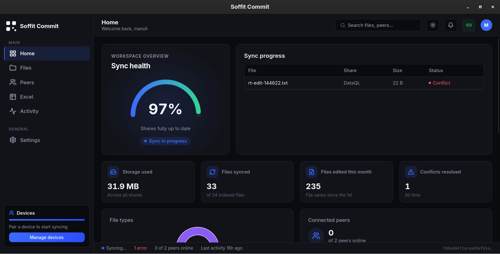

# Soffit Commit

**A private, local-first workspace for syncing folders, documents, spreadsheets, and SQL — peer to peer, with offline AI assistance built in.**

[](https://github.com/gmtechs/Soffit-Commit/releases/latest)
[](https://github.com/gmtechs/Soffit-Commit/actions/workflows/release.yml)
[](https://github.com/gmtechs/Soffit-Commit/releases/latest)
[](https://tauri.app)



---

## Downloads

**Current release: [v1.1.0](https://github.com/gmtechs/Soffit-Commit/releases/tag/app-v1.1.0)** — choose the file that matches your operating system and processor.

| Platform | Installer | Size | Download |
| --- | --- | --- | --- |
| Windows x64 | `.exe` setup — recommended for most PCs | 8.0 MB | **[Download for Windows](https://github.com/gmtechs/Soffit-Commit/releases/download/app-v1.1.0/Soffit.Commit_1.1.0_x64-setup.exe)** |
| Windows x64 | `.msi` — for managed or scripted installs | 11.0 MB | [Download the MSI installer](https://github.com/gmtechs/Soffit-Commit/releases/download/app-v1.1.0/Soffit.Commit_1.1.0_x64_en-US.msi) |
| Linux x64 | `.AppImage` — make it executable, then open it | 88.0 MB | [Download for Linux](https://github.com/gmtechs/Soffit-Commit/releases/download/app-v1.1.0/Soffit.Commit_1.1.0_amd64.AppImage) |
| Debian / Ubuntu x64 | `.deb` package | 12.8 MB | [Download the Debian package](https://github.com/gmtechs/Soffit-Commit/releases/download/app-v1.1.0/Soffit.Commit_1.1.0_amd64.deb) |
| macOS — Apple silicon | `.dmg` for M-series Macs | 10.3 MB | [Download for Apple silicon Macs](https://github.com/gmtechs/Soffit-Commit/releases/download/app-v1.1.0/Soffit.Commit_1.1.0_aarch64.dmg) |

> The Intel macOS (`.dmg`) build was still queued when this README was updated, so it is not listed above. It will appear on the [app-v1.1.0 release page](https://github.com/gmtechs/Soffit-Commit/releases/tag/app-v1.1.0) once its GitHub Actions job finishes.
>
> Windows and macOS installers are not code-signed in this repository yet, so the operating system may show a trust warning. Add signing credentials before distributing to end users.

## Features

### Sync and sharing
- **Peer-to-peer sharing over Iroh** — paired devices exchange files directly, with no central server holding your data.
- **Shared folders with per-device permissions** — set each paired device to *no access*, *can view*, or *can edit* on any share.
- **Pairing by code** — a compact code for devices on the same network, or a full connection code for other setups.
- **Favourites, recent files, and selective sync** to keep large shares manageable.
- **Conflict detection and resolution** with file version history and restore.
- **Collaborative locks** so two people do not overwrite the same document.
- **Activity feed** recording what changed, when, and on which device.

### Documents and data
- **Excel viewer and editor with full fidelity** — styles, fonts, colors, formulas, merged cells, and multiple sheets render as they do in Excel.
- **SQL workspace** — query CSV, JSON, SQLite, and Parquet files, run scripts, import dumps, and export results.
- **Offline AI assistance** — an in-process, CPU-only model powers document chat, data insights, conflict explanations, and activity summaries, so content never leaves your machine.

### Desktop app
- Native installers for Windows, macOS, and Linux, built with Tauri 2 (Rust + React).
- Dark, black-and-blue interface with a storage widget, sync health, and live peer presence.

## Release builds

Pushing a version tag such as `app-v1.1.0` starts native GitHub Actions builds for Windows x64, Linux x64, Intel macOS, and Apple-silicon macOS. The workflow attaches every installer above to a single published GitHub release, which avoids attempting to cross-compile macOS installers on Linux.

## Development

```bash
npm install
cargo tauri dev
```

## Testing with a second local device

Use the normal command above for your first device. To run a second, independent
development device on the same computer, start this launcher in another terminal:

```bash
./scripts/run-second-instance.sh
```

It runs the frontend on `127.0.0.1:1422` (the primary instance uses `1420`) and stores
the second device's database, settings, and Iroh identity in
`.tauri-test-instance/`. The two windows therefore behave like two separate PCs
for account, pairing, and peer-to-peer testing.

To keep the second device running after closing the terminal or ending an agent
session, run it in a detached tmux session:

```bash
tmux new-session -d -s soffit-second './scripts/run-second-instance.sh 2>&1 | tee logs/second-instance.log'
```

Watch its startup output with `tail -f logs/second-instance.log` or attach with
`tmux attach -t soffit-second`. Detach from tmux with `Ctrl-b`, then `d`; stop it
with `tmux kill-session -t soffit-second`. To reset the simulated
device completely, stop it and delete only `.tauri-test-instance/`; this does not
affect the primary instance.

## Build

```bash
cargo tauri build
```
